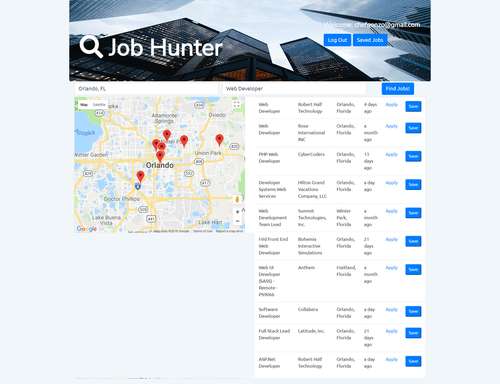

# Job Finder

### This was a collaborative group project for the UCF Coding Bootcamp. Requirements of the assignment were to utilize 2 or more API's, Use a technology that is new to us, and use a database to store persistent data. Our group decided to make a job finder application that utilizes the Google Maps API, Google Places API, and Career One Stop Api. It also uses complete user authentication and a Google Firebase Database.

## Screenshot

## Technologies Used
* HTML
* CSS
* JavaScript
* jQuery
* Bootstrap
* Google Firebase Authentication
* Google Firebase Database
* Google Maps API
* Career One Stop API
* Google Places API
* Google Places Library
* Visual Studio Code
* Font Awesome
* Google Fonts
* Adobe Photoshop

## Collaborators
* https://github.com/mirtacarter
* https://github.com/MinneolaMike
* https://github.com/twolliston
* https://github.com/BenjaminPisaris

## Try Our Job Finder
https://minneolamike.github.io/Group-Project-1/